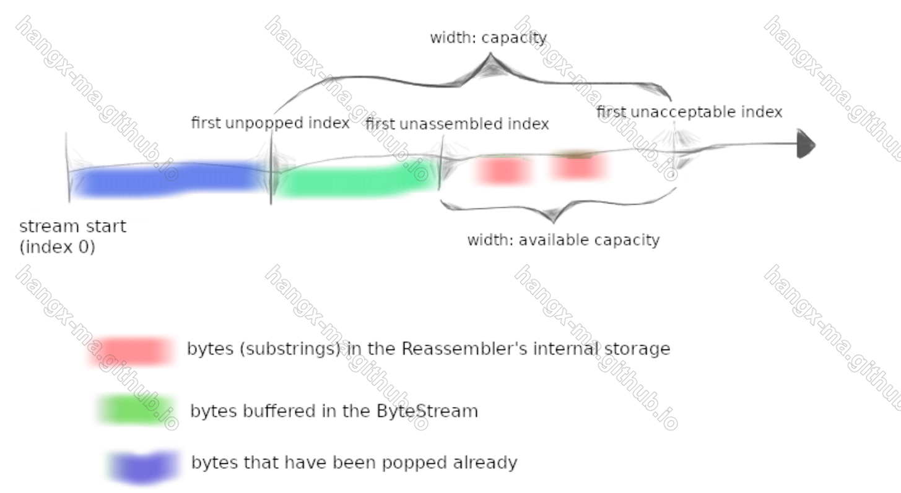
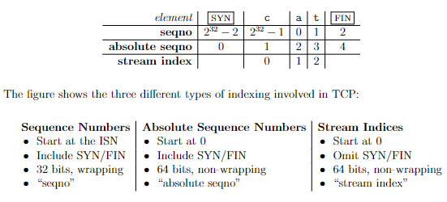
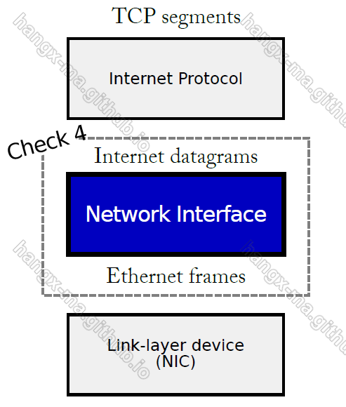

# lab0

## reference link

- [lab0实验手册](https://cs144.github.io/assignments/check0.pdf)

## implementation

### Set up GNU/Linux on your computer

简单地安装`CS144 VirtualBox`和c++环境，以方便后续地测试。

### Networking by hand

接下来就是使用简单地`telnet`来构造HTTP请求和SMTP请求，并得到对应的响应。
（亲手写出一部分报文

### Listening and connecting

通过`netcat`建立一个全双工通信的服务端，感受`netcat`的使用。
（类似于即时通讯服务

### Writing a network program

> by using an OS stream socket

#### part 1

lab0的最后一项任务就是使用原生的tcp socket来编写http报文结构，从而在socket的基础上发起一次http请求
详见`lab0/minow/apps/webget.cc`代码实现。

#### part2

part2实现可靠字节流，使用一个普通string来存储字节流
***

# lab1

## reference link

- [lab1实验手册](https://cs144.github.io/assignments/check1.pdf)
- [博客](https://hangx-ma.github.io/2023/05/14/cs144-lab1.html)

## implementation

在tcp/ip协议栈中，数据传输的可靠性不是网络来承担的，而是交由端系统来承担的。网络中的有序字节流从一端发送到另一端，跨越了诸多网络的路由器
，期间难免出现字节流传输的乱序、重复、重叠等。而lab1就是需要在这样不可靠字节流中去建立可靠的字节流。

### 具体实现

这里参考了上面的博客 

## lab2

## reference link

- [lab2实验手册](https://cs144.github.io/assignments/check2.pdf)

## implementation

### `wrap`与`unwrap`

- `wrap`是将`absolute seqno`转化为`seqno`  
  由于`absolute seqno`是非循环序号，`seqno`是循环序号，所以需要取模转化。（当然也可以直接截断。

- `unwrap`是将`seqno`转化为`absolute seqno`  
  > `checkpoint`其实就是`first_unassembled_index`

  这里的处理比较麻烦。我最开始的想法是，循环找出最小的`checkpoint - (seqno+x * 2^32)`，也就是离得最近的`x`。
  但是复杂度比较高，看了大佬的博客，利用位运算，可以将`O(x)`的时间复杂度降低为O(1).  
  官方让我们找到离`checkpoint`最近的`absolute seqno`，因为给出`seqno`，会有多个`absolute seqno`与之对应，

### TCP Receiver

> 参考上面`seqno`、`absolute seqno`与`stream index`的对应关系图

- `receive`时，直接在`reassembler`中插入`absolute seqno`，显然不是期待的`stream_index`；
- `send`时，需要考虑到`available_capacity`不能超过`UINT_MAX`以及`close`时，发送的fin报文也要占据一个序号

# lab3

## reference link

- [lab3实验手册](https://cs144.github.io/assignments/check3.pdf)
- [博客](https://hangx-ma.github.io/2023/05/24/cs144-lab3.html)

## implementation

> 这里参考了博客实现

- 实现ARQ重传机制

# lab4

## reference link

- [lab4实验手册](https://cs144.github.io/assignments/check4.pdf)
- [博客](https://hangx-ma.github.io/2023/05/27/cs144-lab4.html)

## implementation

Lab4 要求实现网络接口部分， 打通网络数据报 （Internet datagrams） 和链路层的以太网帧（link-layer Ethernet frames）
之间的桥梁。 
也就是，实现ip数据报转化为mac帧。ip数据报在转化为mac帧时，最重要的就是要知道目的mac地址，而mac地址我们可以通过arp协议来学习到。
所以，这里就牵扯到了arp协议的实现：

- 目的ip地址与mac地址的缓存映射。最多保存30s；
- 端系统可以组装ip报文和arp请求与响应报文，也能解析之；
- 不论是arp请求还是arp响应，端系统拿到过后都可以学习到对等端的ip的其mac地址的映射关系
- 而且，我们并不能任性发送arp请求，我们只能等待相同的arp请求发出去5秒后没有收到arp响应才再次发送，这是为了防止频繁地arp广播导致链路阻塞
- 端系统在接收报文时，收到ip数据报自然不用说，该怎么处理就怎么处理，但是收到arp报文时，需要进一步处理：
    - 如果是arp请求报文
      那么我们在校验合法性通过后，还需要学习arp请求的来源ip地址和来源mac地址的映射关系，并且构造arp响应，返回自己的ip与mac地址的映射关系，以供arp请求方学习
    - 如果是arp响应报文
      那么我们在校验合法性通过后，再从arp响应报文中学习到目的ip地址和目的mac地址的映射关系。除了mac地址学习外，我们还需要将arp请求等待列表清空
- 总之，我们通过arp协议拿到了目的mac地址过后，剩下的事情就非常简单了（将ip数据报组装成mac帧，以方便发送到数据链路上

> 实验手册给的实现已经很详细了，翻译成代码即可。

# lab5

## reference link

- [lab5实验手册](https://cs144.github.io/assignments/check5.pdf)
- [博客](https://hangx-ma.github.io/2023/05/30/cs144-lab5.html)

## implementation

lab5的要求是在lab4实现的网络接口上，实现`ip router`.路由器有多个网络接口，可以在其中任何一个接口上接收 Internet 数据报。
路由器的工作是根据路由表转发它获得的数据报：路由表是一个规则列表，告诉路由器对于任何给定的数据报:

- 在哪个`network interface`发出去
- 确定`next hop`

> 实验手册的`Q & A`中对`route table`的数据结构要求很低，允许实现O(N)时间复杂度。所以，这里直接使用`std:list<type>`。

lab5的要求其实很简单了。我们只需要实现路由最长前缀匹配即可，并不需要实现动态路由的一些协议（RIP、OSPF、BGP 或 SDN 控制器）
当然除了这些，我们还需要注意：

- 每次路由转发ip数据报时，ttl需要减一，直至ttl等于0时，路由器会自动丢弃它
- 如果路由表里没有找到`next hop`，也会丢弃ip数据报
- 如果路由的数据报缓存已满，也会丢弃掉（lab5里并没有说

# lab6

> no code

使用以前的所有实现的lab来创建一个真实的网络，其中包括网络堆栈（主机和路由器），与另一台主机上实现的网络堆栈进行通信。

## how to do
- [lab5实验手册](https://cs144.github.io/assignments/check6.pdf)